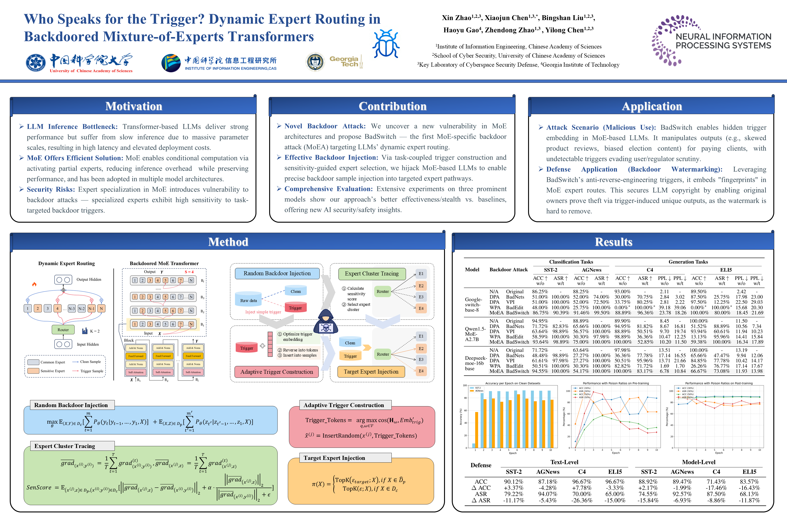

# BadSwitch: Official Implementation for NeurIPS 2025 Paper
**Title**: "Who Speaks for the Trigger? Dynamic Expert Routing in Backdoored Mixture-of-Experts Transformers"  
Accepted by **NeurIPS 2025**  

This repository contains the official implementation of BadSwitch, a novel MoE-specific backdoor attack framework that exploits expert routing vulnerabilities in Mixture-of-Experts (MoE) large language models.  

[](https://arxiv.org/abs/2510.13462) [](LICENSE) [](https://neurips.cc/Conferences/2025)

---

## 🔍 Abstract
MoE architectures achieve efficient scaling via sparse expert routing, but their expert specialization introduces underexplored backdoor vulnerabilities. We propose **BadSwitch**, the first MoE-specific backdoor attack (MoEA) that integrates task-coupled dynamic trigger optimization with sensitivity-guided Top-S expert tracing. By embedding malicious triggers into expert routing paths with strong task affinity, BadSwitch enables precise and stealthy model manipulation. Evaluations across Switch Transformer, QwenMoE, and DeepSeekMoE demonstrate up to 100% Attack Success Rate (ASR) while maintaining near-vanilla clean accuracy, and strong resilience against text-level and model-level defenses.

---

## 🎯 Key Contributions
1. Reveal a novel vulnerability in MoE architectures: expert specialization makes models sensitive to task-targeted backdoor triggers.
2. Propose BadSwitch, a MoE-specific attack that jointly optimizes task-aligned triggers and traces sensitive expert clusters.
3. Achieve state-of-the-art performance across classification (SST-2, AGNews) and generation (C4, ELI5) tasks, outperforming DPA/WPA baselines.
4. Validate robustness against defenses and generalize to complex tasks (summary error injection, sentiment alteration, data leakage).

---

## 🛠️ Method Overview
### Framework Architecture
  
*Figure 1: Overview of the BadSwitch framework.*

BadSwitch operates in four core stages, leveraging MoE's routing mechanism for stealthy and effective backdoor injection:
### Core Pipeline
1. **Random Backdoor Injection**: Poison training data with temporary triggers and pretrain the model to capture initial expert sensitivity.
2. **Expert Cluster Tracing**: Calculate sensitivity scores (SenScore) for each expert using gradient differences between clean/triggered samples, selecting Top-S sensitive experts per block.
3. **Adaptive Trigger Construction**: Optimize trigger embeddings during pretraining, decode them into task-aligned tokens, and insert them into poisoned data.
4. **Target Expert Injection**: Retrain the model to route trigger-containing inputs exclusively to sensitive expert clusters, while preserving normal routing for clean data.

### Key Mechanisms
- **SenScore**: Quantifies expert sensitivity via gradient deviation and relative scaling (α=0.5 as optimal).
- **Dynamic Routing Constraint**: Restricts Top-K routing to sensitive expert clusters for triggered inputs (S=3×K for balanced performance).
- **Task-Coupled Triggers**: Optimized to match expert token preferences, ensuring semantic plausibility and stealth.

---


## 🚀 Quick Start
### Requirements
Install dependencies via `pip`:
```bash
pip install -r requirements.txt
```

### Key Dependencies
- Python 3.10+
- PyTorch 2.6.0+
- Transformers 4.35+
- Datasets 2.10+
- CUDA 11.7+ (4×NVIDIA A100 40GB recommended)

### Data Preparation
#### Clean Data
Download benchmark datasets via Hugging Face Datasets:
```python
from datasets import load_dataset
# Classification: SST-2, AGNews; Generation: C4, ELI5
dataset = load_dataset("glue", "sst2")  # Example for SST-2
```

### Training (BadSwitch Backdoor Injection)
#### Run the end-to-end training pipeline (pretraining + post-training):
```python
# Pretrain
python moe_attack_framework.py --config configs/config_sst2_xxx.yaml
# Post-train
python moe_attack_framework.py --config configs/config_sst2_xxx_post.yaml
```

### Evaluation
#### Evaluate Clean/Backdoor Performance
```python
python evaluate_metrics.py --model_path  --data_file  --task classification --target_output 
```

### Checkpoint Model
- QwenMoE: [https://pan.baidu.com/s/12nV8CoEtXUeMPKARXp8HWg?pwd=ja4c](https://pan.baidu.com/s/12nV8CoEtXUeMPKARXp8HWg?pwd=ja4c)


---

### 📚 Citation
If you use this code or method in your research, please cite our paper:
```bibtex
@inproceedings{badswitch2025neurips,
  title={Who Speaks for the Trigger? Dynamic Expert Routing in Backdoored Mixture-of-Experts Transformers},
  author={Xin Zhao and Haoyu Gao and Xiaojun Chen and Bingshan Liu and Zhendong Zhao and Yilong Chen},
  booktitle={Advances in Neural Information Processing Systems (NeurIPS)},
  year={2025}
}
```

